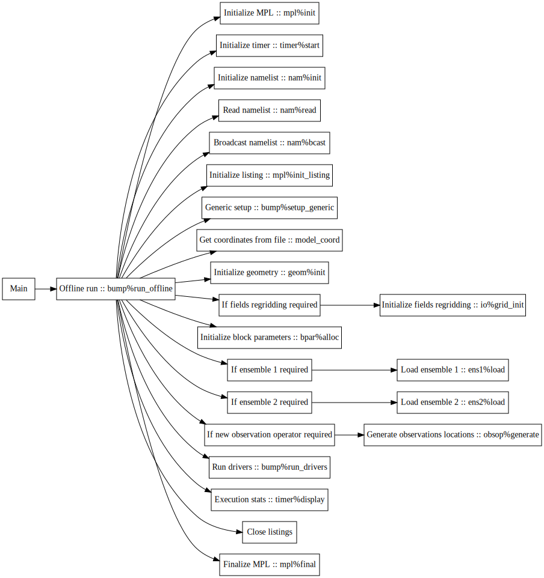
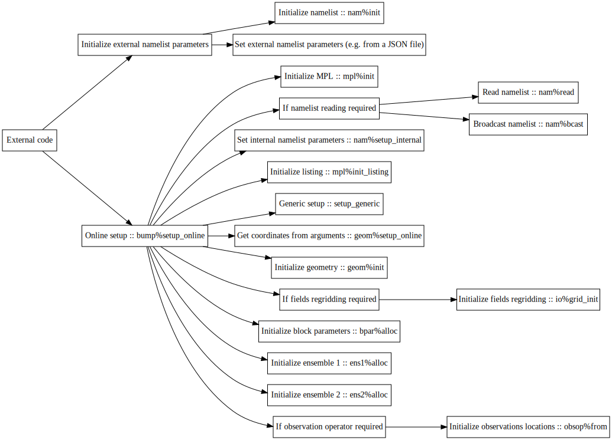

# Code architecture

- [Offline run](#offline_run)
- [Online run](#online_run)
  * [Setup](#setup)
  * [Run](#run)
  * [Apply](#apply)
    + [Get parameters](#get_parameters)
    + [Apply vertical balance operator](apply_vertical_balance_operator)
    + [Apply NICAS](#apply_nicas)
    + [Apply observation operator](#apply_observation_operator)
  * [Deallocate](#deallocate)

## Offline run

## Online run

#### Setup

#### Run

#### Apply

###### Get parameters

###### Apply vertical balance operator

###### Apply NICAS

###### Apply observation operator

#### Deallocate

# Drivers

